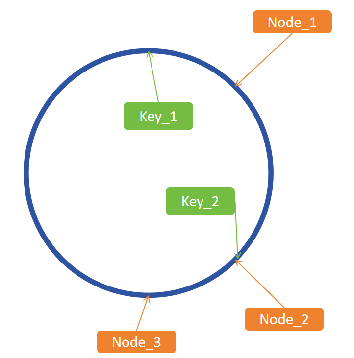

# 一致性哈希
考虑分布式缓存存储，当一个节点收到请求，但是该节点并没有存储
对应内容，此时应该考虑去什么地方获取数据。

假如每一个缓存都存储同一份内容的副本，这样分布式节点的效率会大打折扣，
一来存储空间浪费，二来各节点同步的成本很高。

若将key进行映射，例如假如有10个节点，对key做一次哈希，并对哈希的结果对10取余，
找对应结果的编号节点，即可解决该问题

但是这种方法也存在<b>缓存雪崩</b>的问题，假如加入一个新节点或者去掉一个节点，此前所有的缓存都将作废。

此时可以考虑<b>一致性哈希</b>。

如图所示，一致性哈希可以看成将每个节点映射到一个环空间上，再将每个key映射到同样的空间，
因此每个key都有唯一对应的节点。如图key_1映射到的位置没有节点，就依次寻找下一个位置是否存在节点，直到找到
一个存在节点的位置Node_1。假设Node_1在某时刻突然失效，Key_1可以递补到Node_2节点，而不至于缓存雪崩。

考虑到当节点数量远少于空间上的点时，可能存在寻找节点耗时过长的问题，如Node_3与Node_1之间存在大量空白。
因此可以考虑使用虚拟节点，一个真实节点对应多个虚拟节点。通过一个<b>map维护真实节点与虚拟节点的映射关系</b>。

构造一个Map结构体实现节点和键的映射

Map数据结构包含
- hash // 映射函数
- replicas // 每个真实节点对应的虚拟节点数量
- keys // 哈希环
- hashMap // 虚拟节点映射表
* Get(key string) string // 选择节点
  * 计算 key 的哈希值
  * 顺时针找到第一个匹配的虚拟节点的下标 idx，从 m.keys 中获取到对应的哈希值。如果 idx == len(m.keys)，说明应选择 m.keys[0]，因为 m.keys 是一个环状结构，所以用取余数的方式来处理这种情况。
  * 通过 hashMap 映射得到真实的节点。
* Add(keys ...string) // 添加节点
  * 传入 0 或 多个真实节点的名称
  * 对每一个真实节点 key，对应创建 m.replicas 个虚拟节点，虚拟节点的名称是：strconv.Itoa(i) + key，即通过添加编号的方式区分不同虚拟节点。
  * 使用 m.hash() 计算虚拟节点的哈希值，使用 append(m.keys, hash) 添加到环上
  * 在 hashMap 中增加虚拟节点和真实节点的映射关系。
  * 环上的哈希值排序